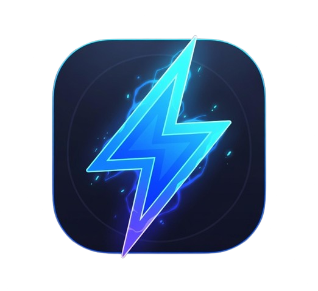

# ⚡️ Volt

Volt is a fast, reliable, and Discord-like chat application built specifically for mobile devices.

## Features

- **Server-like Navigation:** Intuitive drawer navigation allows users to switch between different "servers" and channels quickly.
- **Real-time Chat Interface:** A sleek and familiar chat UI supporting dynamic dark/light themes.
- **Mobile First:** Designed and optimized for iOS and Android platforms using React Native and Expo.
- **Cross-Platform Consistency:** Ensures a unified experience across devices with custom UI components.

## Architecture

Volt is built upon a modern React Native stack:

- **Framework:** [Expo](https://expo.dev/) (SDK 54) for rapid development and prebuilding native code.
- **Navigation:** [React Navigation](https://reactnavigation.org/) utilizing `expo-router` for file-based routing and seamless screen transitions.
- **UI & Styling:** Core React Native components enhanced with `react-native-reanimated` and `react-native-gesture-handler` for smooth, native-feeling interactions. Theme-aware styling dynamically adjusts to user preferences (Dark/Light mode).

### Key Files & Directories

- `app/`: Contains the core screens and navigation logic using `expo-router`.
  - `_layout.tsx`: Root layout defining the Drawer navigation structure.
  - `index.tsx`: The home screen representing a server's channel list.
  - `chat.tsx`: The primary chat interface component.
- `assets/`: Houses static resources like the app icon and splash screens.
- `hooks/`: Custom React hooks, including `use-color-scheme` for theme detection.

## Getting Started

- Info coming soon

### Running the App

- Download the latest mobile build on our releases page
